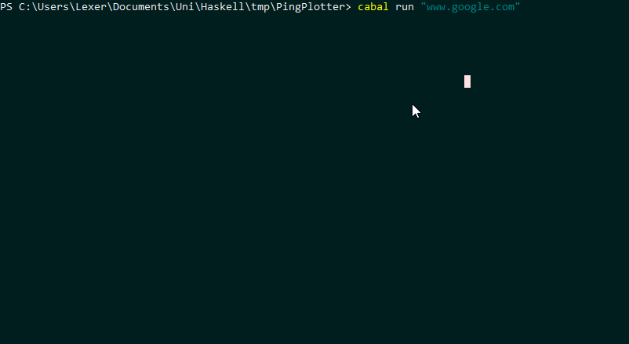

# Did you always want a haskell & command line based ping graphing tool?

Of course you didn't. So I wrote one.

## Installation

1. Have haskell installed, and all the dependencies. <sub> A trivial task left to reader </sub>

2. Run these commands:

``` shell
$ git clone https://github.com/Lexer747/PingPlotter.git
$ cd /PingPlotter/
PingPlotter> $ cabal run "www.google.com"
```
3. Use at your own risk!

### Demo



<sub> Yes, I know, my ping sucks. </sub>

## Feature List

* Draws a graph showing the ping of a website or IP address
* other list item
* also another list item

## Un-installation

Since you used it once you'll need these commands

``` shell
PingPlotter> $ cd ..
$ rm -r /PingPlotter/
```

### Credits & License

Some dude - 